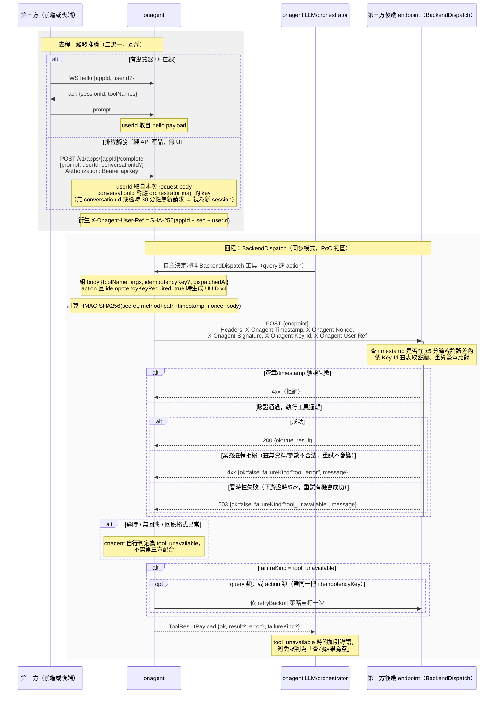

# BackendDispatch：第三方後端工具串接方案

> **目前實作狀態（最小可行版本）**：已實作 `Tool.BackendDispatch`（`Endpoint`、`TimeoutMS` 兩個欄位），工具呼叫可派發到第三方後端、同步等待回應並餵回 LLM 上下文，觸發路徑僅限既有 WS `hello`/`prompt`。以下皆**尚未實作**：`POST /v1/apps/{appId}/complete` 後端直觸端點、HMAC 簽章與雙密鑰輪替（目前是明文、無驗證的請求，僅適合已透過其他管道信任的端點）、`conversationId`/閒置逾時的多輪 session 機制。其餘章節為完整設計方案，尚待後續版本補齊。

> 本文件是 [third-party-backend-tool-integration-discussion-2026-08-07.md](third-party-backend-tool-integration-discussion-2026-08-07.md) 第二輪討論拍板後的方案結論，完整討論逐字稿與決策過程請見該文件。這裡只保留最終方案本身，方便日後查閱時不用重新讀完整場會議記錄。

第一輪基於前端架構的結論已隨第一輪內容一併移除，不再適用。以下是第二輪、第三輪拍板的完整方案。

## 0. 觸發推論（去程）

`BackendDispatch` 的回程（onagent 主動打第三方後端）只有在「onagent 先開始一輪 LLM 推論」的前提下才會發生。onagent 目前提供兩條去程路徑，第三方依自己的觸發場景擇一：

- **WS `hello`/`prompt`**（既有機制）：前端瀏覽器分頁開 WS 連線，`hello` 帶 `appId` 與可選的 `userId`，之後送 `prompt` 觸發推論。適合有瀏覽器 UI 在線的場景。
- **`POST /v1/apps/{appId}/complete`**（新增）：給第三方**後端**直接呼叫，不經過 WS/瀏覽器，適合排程觸發、純 API 產品等無 UI 場景（這是 onagent 最初完全缺漏、第三輪才補上的路徑）。認證用 `Authorization: Bearer <apiKey>`（複用既有 `auth.Store.Verify`），body 帶 `prompt`、`userId`、可選 `conversationId`。

**Session 生命週期**：`POST .../complete` 沒有 WS 連線可以借用生命週期，改用第三方自己傳遞的 `conversationId` 對應到 orchestrator map 的 key，讓同一趟多輪呼叫（例如 LLM 自主規劃行程、需要第三方連續呼叫這支 API 多次才能收斂）能延續先前的推論上下文，而不是每次都是一次性的全新 session。相應地引入閒置逾時機制（例如 30 分鐘無新請求自動清理），取代 WS 連線斷開才觸發的 `CloseSession`。

**`X-Onagent-User-Ref` 的來源消歧義**：無論哪條去程路徑，最終都會衍生出同一個不透明識別碼 `X-Onagent-User-Ref`（見第 6 節），但輸入 `userId` 的來源依觸發路徑二選一、互斥——WS 路徑吃 `hello.userId`；`POST .../complete` 路徑吃該 API request body 的 `userId`。不存在「兩者都給、以誰為準」的情況，實作時不可各自假設。

## 1. 整體方向

onagent 將新增 `BackendDispatch`——一種讓第三方在自己的後端跑工具、由 onagent 主動以 outbound HTTP 呼叫觸發的機制，完全獨立於既有的前端／WebSocket `askPage` 路徑，兩者並存、互不取代。認證採 onagent 對第三方單向 HMAC 簽章（可選加 mTLS/IP allowlist），密鑰輪替走雙密鑰並存期。

### 端到端連線流程（去程觸發 + 同步 dispatch 回程）



## 2. Schema 設計：`toolschema.Tool` 新增 `BackendDispatch` 區塊

```go
type BackendDispatch struct {
    Kind      BackendDispatchKind // "query" | "action"
    Endpoint  string
    Auth      AuthRef             // 指向密鑰管理系統的 reference，不存明文
    TimeoutMS int
    Mode      string              // "sync"（目前唯一允許值）| "async"（預留，未實作）

    Query  *QueryDispatch
    Action *ActionDispatch
}
type QueryDispatch struct { Retryable bool }
type ActionDispatch struct {
    IdempotencyKeyRequired bool
    RetryBackoff string
}
```

- `query`／`action` 兩種 `kind` 各自獨立欄位分組，不共用重試語意——`query` 失敗直接無腦重打；`action` 重試須帶同一把 idempotency key。
- `idempotencyKeyRequired` 為真時，key 由 **onagent 後端在 dispatch 當下生成 UUID v4**，不開放第三方自訂格式；新 dispatch 路徑獨立生成，不沿用/不影響既有的 `ws/id.go` `randomID()`。
- `Mode` 欄位現在只允許 `"sync"`，`"async"` 值域保留給未來 callback 機制開放時使用，不需要重新設計 schema 結構。

## 3. 通訊協定（同步模式，PoC 範圍）

**Request**：`POST {endpoint}`，body `{toolName, args, idempotencyKey?, dispatchedAt}`。

**Headers**：`X-Onagent-Timestamp`（unix seconds）、`X-Onagent-Nonce`（16 bytes hex）、`X-Onagent-Signature`（HMAC-SHA256 hex）、`X-Onagent-Key-Id`（對應密鑰並存期的哪一把）、`X-Onagent-User-Ref`（見第 6 節）。

**簽章**：`HMAC_SHA256(secret, method + "\n" + path + "\n" + timestamp + "\n" + nonce + "\n" + body)`，概念上參考 Stripe webhook／AWS SigV4 但拼法為自訂組合。onagent 承諾在正式規格文件附上 Go／Python 雙語參考驗證 script（固定 fixture 可比對），並評估提供最小 verify library，降低第三方各自重刻簽章邏輯的風險。timestamp 容許誤差 ±5 分鐘。

**Response**：成功 `200` `{ok:true, result}`；`tool_error`（業務邏輯拒絕，重試不會變）回 `4xx`；`tool_unavailable`（暫時性失敗，重試有機會成功）第三方主動回 `503`，或由 onagent 在逾時/無回應/格式異常時自行判定。**分類原則**：不看失敗發生在第三方自己的服務還是其依賴的下游，只看「重試是否有機會成功」。

**逾時與重試**：`query` 逾時或 `tool_unavailable` 直接重打一次；`action` 重試須帶同一把 `idempotencyKey`，退避策略見 `retryBackoff`；`tool_error` 一律不重試。逾時值來自 schema 的 `timeoutMs`，需求上等同於現有 `interactionTimeout`（`ws/session.go` 的 package-level `var`）改成 per-tool 可配置，屬小改動。

## 4. 降級語意（`FailureKind`）

`protocol.ToolResultPayload` 新增 `FailureKind string`（`"tool_error" | "tool_unavailable"`），比照既有 `ErrorPayload.Code` 的先例。`tool_unavailable` 時對 LLM 附加明確引導語（例如「此資訊來源暫時無法取得，請根據既有資訊繼續」），避免被誤判成「查詢結果為空」。

## 5. 密鑰管理

現有 `internal/auth` 的 app API key 是一次性顯示、輪替即覆蓋失效，**沒有並存機制**，不能沿用。改為新建 store（形狀比照 `usertoken.Token`：`id`/`createdAt`/`lastUsedAt`/`expiresAt`），一個 app 同時可有 0-2 把有效密鑰；輪替時新舊並存（預設 7 天可調），驗證時兩把都嘗試；外洩時可單方立即撤銷（`expiresAt` 設為過去時間，不刪列）。Console 密鑰管理頁只顯示中繼資訊，不重複顯示明文。

Staging/production 環境隔離：onagent 目前完全沒有 app 層級的環境概念，傾向讓開發者自行註冊兩個獨立 `AppID`（不需修改 schema），非本輪定案。密鑰按工具細分權限：延後到 PoC 穩定後再談，非本輪範圍。

## 6. 使用者/session 識別碼：`X-Onagent-User-Ref`

協定原始草案僅有 app 層級的 `Key-Id`，缺少「這通呼叫屬於哪個使用者」的資訊，會讓 per-user 限流、個人化推薦、除錯歸屬三項真實需求落空。**修正後方向**：`hello` 協定新增可選欄位 `userId`（`HelloPayload`，`protocol/message.go`），或第三輪新增的 `POST /v1/apps/{appId}/complete` request body 的 `userId`（見第 0 節，兩條路徑互斥，依觸發方式二選一），onagent 不驗證真實性（信任邊界與現有 `appId` 認證模型一致）。onagent 將 `appId` + `userId` 組合後取 SHA-256 雜湊（避免字串直接串接的命名空間碰撞風險），衍生出不透明的 `X-Onagent-User-Ref`。WS 路徑存進 `ws.Session` 新欄位、跟隨該連線的所有工具呼叫；`POST .../complete` 路徑則跟隨該次呼叫對應的 `conversationId`。

此識別碼與既有 per-session `Orchestrator`/`sessionID`（連線層級技術隔離）是兩個獨立機制，可並存不衝突；也與 `AckPayload.SessionID`（連線層級、回傳給 client）語意不同，需在規格文件明確消歧義。

## 7. 非同步（callback）模式：預留不實作，機制定案為 callback

部分工具（例如需等待風控流程的退款）處理時間可能遠超同步 timeout。方向：`ActionDispatch.Mode: "async"`（本輪不開放此值）搭配第三方立即回 `202 Accepted`、稍後主動呼叫 onagent 開放的 callback endpoint 回傳結果；callback 認證方向反轉（第三方簽章、onagent 驗證）；等待期間需要獨立於 `tool_unavailable` 的「已受理、處理中」中間態語意。

> **這個機制曾在第三輪被短暫改為「onagent 主動輪詢第三方 `GET {endpoint}/tasks/{taskId}`」**（參考 Anthropic MCP 2026-07-28 規格的 poll-based Tasks 框架），因為輪詢能同時避開 callback 認證反轉與多副本部署下 in-memory 關聯失效這兩個問題。但進一步評估後發現：callback 是被動輕量（等待任務僅需一個 channel/goroutine，形狀同 `ws/session.go` 的 `pendingCalls`），輪詢則需要 onagent 對每個進行中任務持續發送真實 HTTP 請求——若同時服務 N 個第三方、每個 M 個並行長任務，輪詢排程量隨 N×M 線性增長，是持續性、隨規模惡化的成本，而非一次性架構成本，與 onagent 作為服務大量租戶的 SaaS 平台定位有摩擦。最終**恢復 callback 為正式方案**，多副本部署風險維持記入技術債。詳細反覆過程見 [third-party-backend-tool-integration-discussion-2026-08-07.md](third-party-backend-tool-integration-discussion-2026-08-07.md) 第三輪結論。

技術可行性已初步查證：路由掛載可套用現有 `http.NewServeMux()`／中介層模式；「等待關聯」可沿用 `ws/session.go` 的 `pendingCalls` map+channel 模式（非 Session 專屬版本）。**已知風險（記入技術債，非本輪解決）**：若 onagent 為多副本部署，callback 請求可能打到與原 dispatch 呼叫不同的 process，in-memory 關聯會失效，需之後視實際部署拓樸決定是否改用共用儲存（如 Postgres LISTEN/NOTIFY）。因非同步模式本輪不啟用，此風險暫不處理。

## 8. PoC 範圍與後續已知項目

**PoC 範圍**：`recommend_nearby`（tripace 真實案例）這類查詢型、無副作用工具，驗證「後端 tool 繞過瀏覽器分頁、直接在 onagent server 端 dispatch 並取得結果」這條路徑本身。退款等 action 類工具、非同步模式均不在此輪 PoC 內。

**已記錄但延後的項目**：
- N² 批次查詢的批次語意（例如未來 `compute-route` 工具需要同一輪查多點對距離，逾時/重試需考慮部分失敗如何讓 LLM 繼續規劃）——屬 orchestrator/LLM 呼叫層的編排問題，與本輪的單次 dispatch 協定設計分屬不同層次，待該工具實際要開發時再議。工程師待查證：`QueryDispatch`/`ActionDispatch` 新增 `Batch *BatchDispatch` 欄位是否為純相容擴充；若會動到既有重試/退避語意則需重新考慮 schema 形狀，查證完成前不預留欄位。
- Callback 機制的多副本部署風險（見第 7 節）。
- Staging/production 環境隔離、密鑰按工具細分權限（見第 5 節）。
- `recommend_nearby` PoC 落地時的已知參數陷阱：現有查詢是純 in-process 呼叫（無網路往返），改走 `BackendDispatch` 後 `timeoutMs` 須另抓一個遠比 20 秒基準小、但仍需容納 Google Places API 尾端延遲的數值，避免誤判為 `tool_unavailable`。
- lint／自訂驗證等其他功能性擴充不在本輪討論範圍內。
